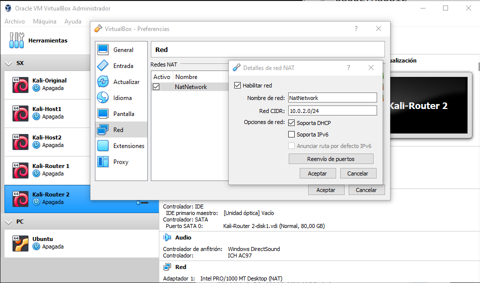

# CONF of the first lab practices

## Scenario and Planning
Scenario conf for the first lab practices, explained as best I can (I swear). In this scenario we work with 3 LANs:

* LAN A or 1: This LAN is composed by the Host1 `eth0` and R1 `eth1`. The network prefix is 192.168.1.0/24.
For this LAN we apply the Router IP convention and I'll give R1 @IP(`192.168.1.1`), for the Host1 @IP(`192.168.1.10`).

* LAN NatNetwork: This is the NatNetwork configured for both R1 and R2 to connect the LANs and also to the Internet. R1 and R2 work with `eth0` both and the network prefix is 10.0.2.0/24.
For this LAN I will select @IP(`10.0.2.1`) to R1 and @IP(`10.0.2.2`) to R2.

* LAN B or 2: This LAN is a copy of the LAN 1, with the only exception that now we have Host2 `eth0` and R2 `eth1`, and the prefix is now 192.168.2.0/24.
I'm planning to give Host2 @IP(`192.168.2.20`) and R2 @IP(`192.168.2.1`).

## Configuration of VirtualBox Networks
### NAT Network
So now we have to configure the VB NAT Network, to do so we can open the Preference Menu > Networks and then add a NatNetwork.



And so, we can change the Network Adapter of R1 and R2 to NatNetwork.

### Internal Networks (or LANs)
For this one we have to change the Host1 and Host2 Network Adapter to an `Internal Network` and give it a name. In my case:

* LAN 1 (or A): `lan1`
* LAN 2 (or B): `lan2`

Also, add one new adapter to R1 and R2 with its correct LAN.

## Configuration of VirtualBox Machines
This is the tedious part as we have to jump into the actual machine to do the work.

I will keep this part simple and within a copy and paste of this code it should work.

* Host 1:
```
# file: /etc/network/interfaces
# This file describes the network interfaces available on your system
# and how to activate them. For more information, see interfaces(5).

source /etc/network/interfaces.d/*

# The loopback network interface
auto lo
iface lo inet loopback

# auto eth0
auto eth0
iface eth0 inet static
        address 192.168.1.10/24
        gateway 192.168.1.1

```

* Host 2:
```
# file: /etc/network/interfaces
# This file describes the network interfaces available on your system
# and how to activate them. For more information, see interfaces(5).

source /etc/network/interfaces.d/*

# The loopback network interface
auto lo
iface lo inet loopback

# auto eth0
auto eth0
iface eth0 inet static
        address 192.168.2.20/24
        gateway 192.168.2.1

```

* R1:
```
# file: /etc/network/interfaces
# This file describes the network interfaces available on your system
# and how to activate them. For more information, see interfaces(5).

source /etc/network/interfaces.d/*

# The loopback network interface
auto lo
iface lo inet loopback


# auto eth0
auto eth0
iface eth0 inet static
        address 10.0.2.10/24
        gateway 10.0.2.1

# auto eth1
auto eth1
iface eth1 inet static
        address 192.168.1.1/24
```

* R2:
```
# file: /etc/network/interfaces
# This file describes the network interfaces available on your system
# and how to activate them. For more information, see interfaces(5).

source /etc/network/interfaces.d/*

# The loopback network interface
auto lo
iface lo inet loopback


# auto eth0
auto eth0
iface eth0 inet static
        address 10.0.2.20/24
        gateway 10.0.2.1

# auto eth1
auto eth1
iface eth1 inet static
        address 192.168.2.1/24
```

Once all of these configs have been made, IT IS HIGHLY IMPORTANT TO RESTART THE NETWORKING SERVICE `systemctl restart networking` as a SUPERUSER (sudo).

## Connectivity through LANs and Internet Connection:

Now we expect to enable IPv4 routing, to give Internet connection to both hosts.

We need to locate the `/etc/sysctl.conf` and uncomment the line `net.ipv4.ip_forward=1`, in BOTH Routers.

Then, the firewall should add masquerading to the forwarded packets using such rule as:
```
iptables -t nat -A POSTROUTING -d 192.168.X.0/24 -o eth0 -j MASQUERADE
```
Where X should be the according LAN number.
